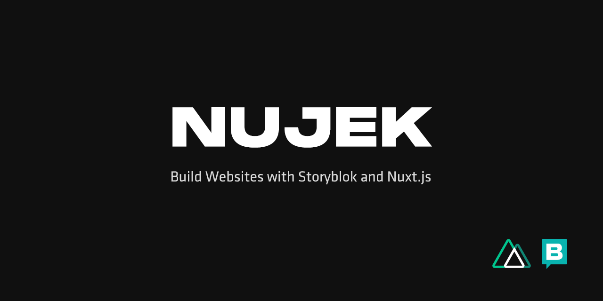

Nujek is a collection of useful Vue.js components and libraries which helps you to build [Storyblok](https://www.storyblok.com/) websites and apps as easy as possible. Helping you to stay productive following and eliminating repetive 
tasks.

- 🎲 &nbsp;Demos on CodeSandbox - WIP
- 📖 [&nbsp;Read the documentation](https://nujek-docs.vercel.app/)

## Starter Project

[Nuxt Storyblok Starter Website](https://github.com/regenrek/nuxt-storyblok-starter) is an example website template to quickstart your project.

## 🚀 Features

* [Docs](https://nujek-docs.vercel.app/) and [Starter Website template](https://github.com/regenrek/nuxt-storyblok-starter)
* Written for vue2
* Auto import components support with @nuxtjs/components
* `@nujek/storyblok` Complete Nuxt.js Storyblok Integration
* `@nujek/storyblok` Useful Storyblok blok viewer for development.
* `@nujek/ui` Powerful tree-shakeable and reusable nuxt components for your next website project
* `@nujek/ui` Component Theming with a configuration approach

## 📦 Install

```
yarn add -D @nujek/ui @nujek/storyblok @nuxtjs/composition-api @nuxtjs/tailwindcss
```

[See install Instructions](https://nujek-docs.vercel.app/documentation/getting-started/installation)

## 🧱 Contribute

[See contribute Guide](https://nujek-docs.vercel.app/documentation/contribute/how-to-contribue)

## Older nujek versions

Here you can find older docs and examples for version **< 2.0.30**

[Interactive examples](https://nujek-storybook.vercel.app/)
[Old docs](https://nujek-old-docs.vercel.app/)
## License

[MIT License](./LICENSE)